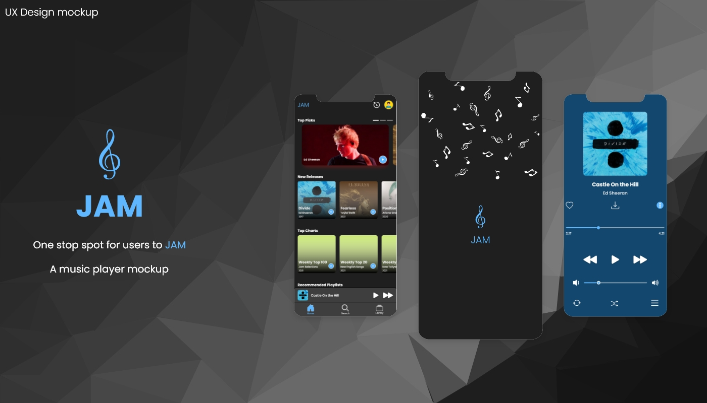
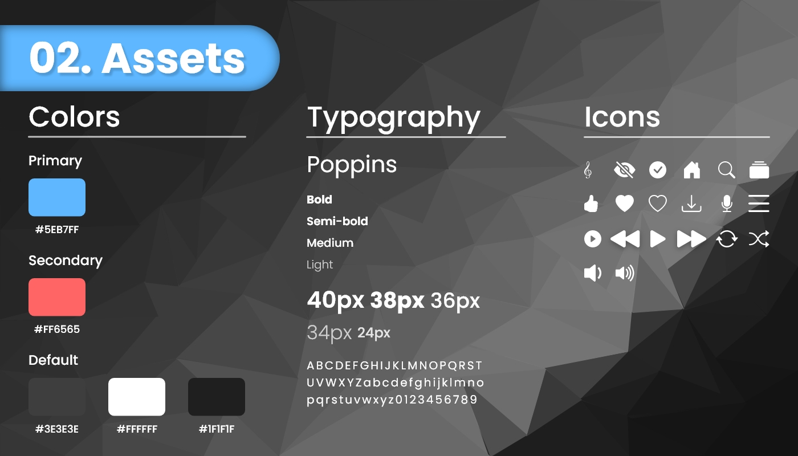
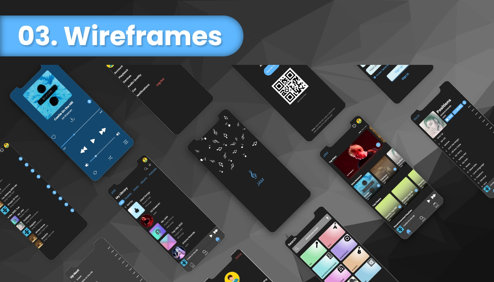
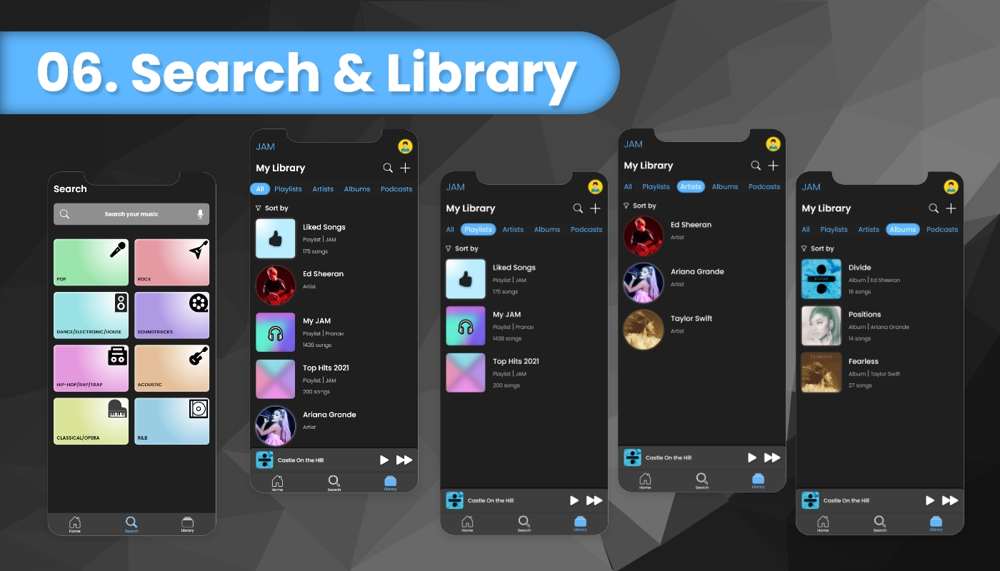
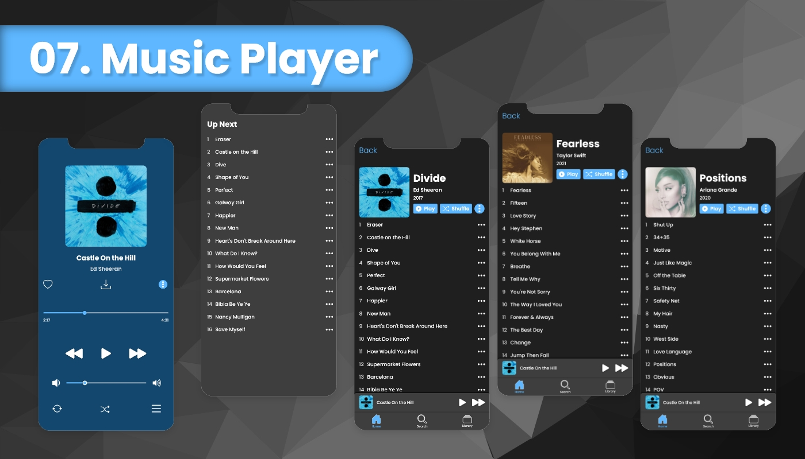
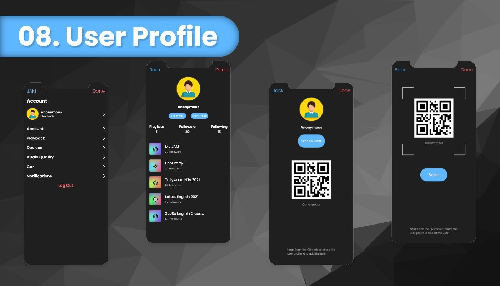

# JAM - Music Player

My design of a mockup music player using Adobe XD.
 
 

### _About the design_
The project is a high fidelity user experience showing a music player.
* About the app : Presents information about the mockup
* Assets : Explains design system
* Wireframes : Shows the high fidelity wireframes
* Onboarding : Landing page of the design
* Home : Contains mini player, navbar, recently played and user account
* Search & Library : Shows different genres, playlists, albums etc.
* Music Player : Displays expanded music player with basic controls and upcoming list
* User Profile : Contains user information and preferences
 
 

---
### _This is how it looks like_
 

 

 

 

 

 

 

